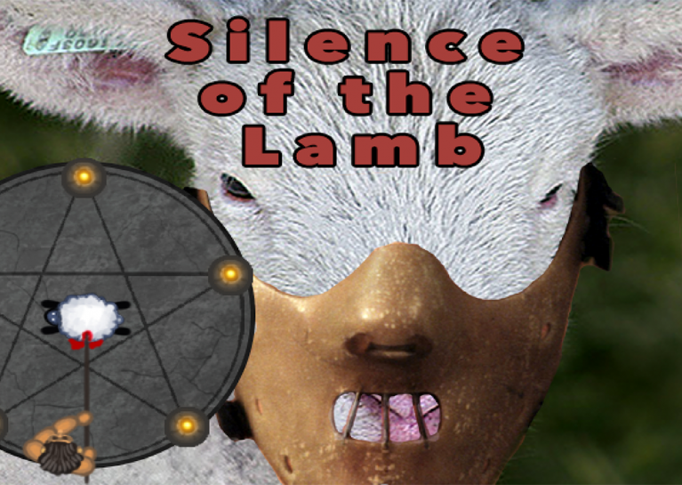
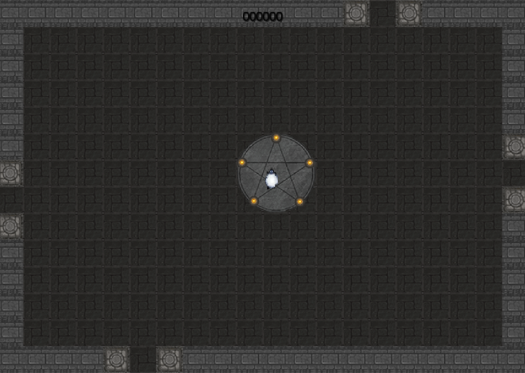
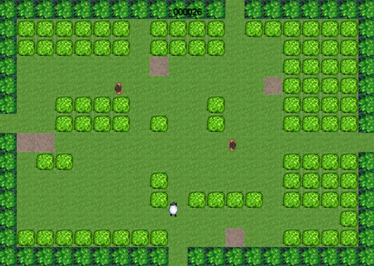
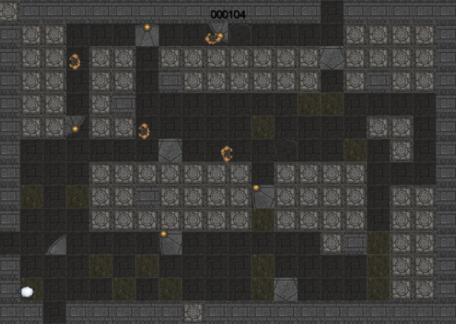
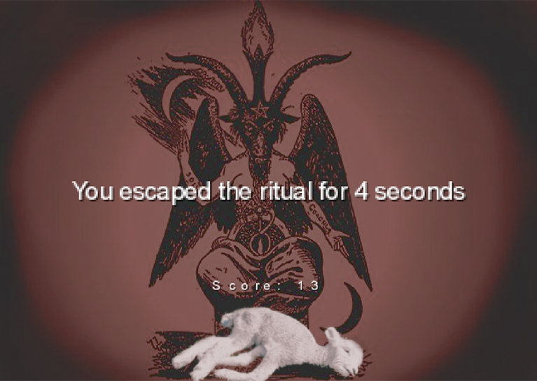

# Silence of the Lamb (sotl)

Silence of the Lamb (sotl) is a simple procedurally generated endless runner.
You play as a lamb attempting to escape the tribesmen who want to sacrifice
you to their gods. The game was created over 48 hours in January 2016 for
submission to the 2016 Global Game Jam. It was created by
[myself](https://github.com/timpeskett), [Jacob
Chapman](https://github.com/jkchapman), and [Luke
Mercuri](https://github.com/mercluke), with art provided by Glen Martin.

We set out to create a simple game, as this was our first game jam and we were
not sure what 48 hours would allow us. In the end, we had created a simple,
yet complete game.

## Screenshots

The title screen. The Hannibal Lecter reference is not really relevant to the
game, so we'll chalk that down to a marketing decision.

This is the starting area. The area is reminiscent of a sacrificial chamber,
which ties in to the ritual theme of the 2016 Global Game Jam. There are
always four exits to this starting area, as it is a map loaded from disc. This
is the only level in the game that is not procedurally generated.

This is a typical grass area. It is procedurally generated, and so it is
unlikely that this exact level will ever be seen again. The yellow tiles are
sand tiles which reduce the speed of the lamb.

This is a typical dungeon area. Dungeon areas become more likely to spawn as
you move further away from the starting area. This provides a reward for the
player and some stark visual affirmation of his/her progress.

The death screen. This screen appears when the lamb is caught by a tribesman.

## Build/Run

sotl is built using libGDX and requires Java 6 or above. After the cloning the
repo, the code can be run using a simple

`./gradlew desktop:run`

Gradle will download all of the necessary libraries to build and run the game.

## Known Bugs

* The tribesmen sometimes teleport through walls. Unfortunately, there simply
  wasn't enough time to fix the traversal properly.
